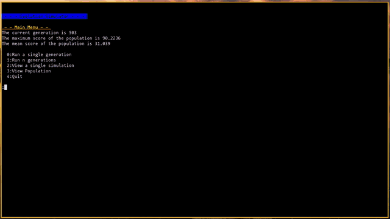

# evolution-simulator
Simulates evolution

## Concept
Creatures are built from muscles and nodes.
The muscles are simply dampened springs whose lenght changes between two values with a certain period.
The nodes are the essence of the creature, these are what interacts with the physical world.
Nodes with darker color has more friction, the ones with lighter has less.
Things that (at least right now) can be modified when creatures procreate are:
* Period of contraction/extension
* Fraction of period spent in contracted state
* Contracted and extended lengths
* The spring constant
* The dampening constant
* The mass of the nodes
* The coefficient of friction of the nodes

## Images
After 503 generations, this is the result:

For comparison, this is the best guy in the first generation:

